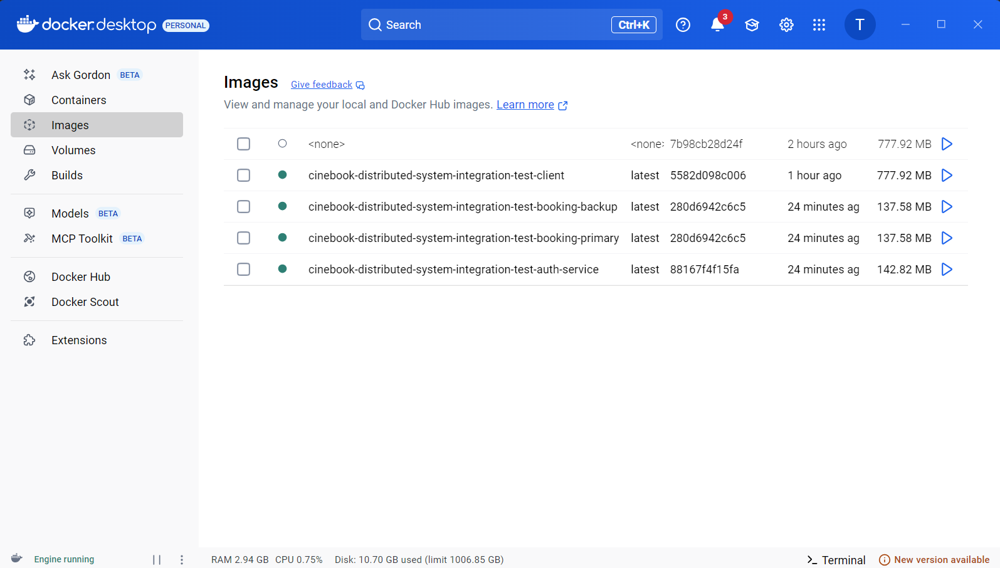
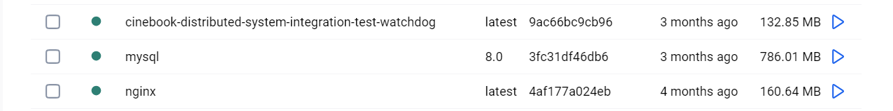
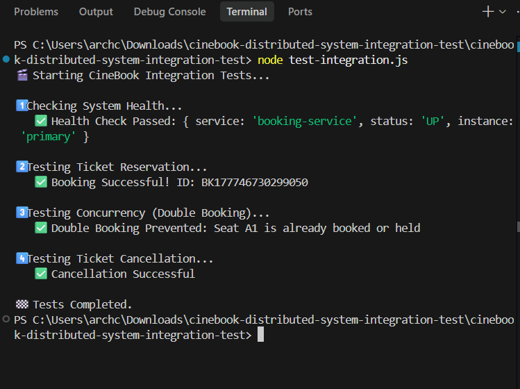

# 🎬 CineBook – Distributed Movie Ticket Booking System

CineBook is a distributed, web-based movie ticket booking system designed specifically to demonstrate core distributed system concepts such as fault tolerance, concurrency control, and scalability in a local environment.

## 🧱 System Architecture

The system is broken down into stateless microservices that communicate over HTTP and are orchestrated using Docker. All services are accessed through a single entry point provided by an NGINX reverse proxy.

*   **API Gateway (NGINX):** Acts as the single entry point for all traffic, routing requests to the appropriate backend services and handling load balancing.
*   **Frontend Client:** A web interface for users to interact with the system.
*   **Auth Service:** Handles user authentication (JWT) and security.
*   **Booking Service:** Manages the core business logic for booking tickets. It runs with a **Primary** and a **Backup** instance to ensure high availability.
*   **Database (MySQL):** Utilizes a **Primary-Replica** architecture. The Primary handles all write operations, while the Replica synchronizes data and handles read operations.

### Port Configuration

| Service | External Port (Docker) | Internal Port | Description |
| :--- | :--- | :--- | :--- |
| **NGINX Gateway** | `8080` | `80` | Reverse proxy & System Entry Point |
| **Frontend Client** | `3000` | `3000` | Web Interface (`/client`) |
| **Auth Service** | `3001` | `3001` | Authentication APIs (`/api/auth`) |
| **Booking (Primary)** | `3002` | `3002` | Main booking APIs (`/api/booking`) |
| **Booking (Backup)** | `3003` | `3002` | Standby booking APIs for failover |
| **MySQL (Primary)** | `3307` | `3306` | Handles Writes |
| **MySQL (Replica)** | `3308` | `3306` | Handles Reads |

---

## 🌟 Distributed System Characteristics

This system is built to demonstrate five core principles of distributed systems:

1.  **High Availability & Fault Tolerance:** If the primary booking service crashes, a custom "Watchdog" detects the failure, and NGINX seamlessly fails over to the backup service without interrupting the user.
2.  **Concurrency & Consistency:** Strict database transaction management and row-level locking prevent "race conditions." If two users try to book the exact same seat at the exact same millisecond, the system prevents double-booking.
3.  **Scalability:** Independent microservices allow parts of the system to be scaled horizontally, while NGINX distributes the traffic load.
4.  **Performance:** Read operations (viewing movies) are routed to the database replica, offloading stress from the primary database and ensuring fast response times during traffic spikes.
5.  **Security & Transparency:** NGINX hides the internal microservice ports and databases from the public. Users only ever interact with `localhost:8080`.

---

## 🚀 How to Run the System (Docker - Recommended)

To avoid port conflicts, the system **must** be run using Docker. Do not run the services manually in separate terminals.

**Prerequisites:** Docker Desktop must be installed and running.

1. Open your terminal in the project root directory.
2. Stop any existing containers and start the system:
   ```powershell
   docker-compose down
   docker-compose up -d --build
   ```
3. Access the application in your browser: [http://localhost:8080/client](http://localhost:8080/client)

### Health Check Verification
You can verify that the backend services are running by visiting these NGINX endpoints:
*   Auth Service Health: [http://localhost:8080/api/auth/health](http://localhost:8080/api/auth/health)
*   Booking Service Health: [http://localhost:8080/api/booking/health](http://localhost:8080/api/booking/health)

---

## ⚠️ Important Rules for Teammates (Integration)

*   **❌ No Hardcoded Ports:** Do not hardcode specific service ports (like `3001` or `3002`) in frontend logic; always route requests through the NGINX gateway (`8080`).
*   **❌ No Cross-Importing:** Do not import code from one microservice directly into another. They must remain completely decoupled.
*   **❌ Do Not Modify Nginx:** Do not modify `nginx.conf` without coordination.
*   **✅ API Routing:** All new APIs should work behind their respective `/api/{service-name}` path in NGINX.

*(Note: Do not add business logic to the `nginx.conf` or the `env.js` files. They are used only for configuration and integration.)*

---

## 🎥 Demo Video (Click the video to watch)

[](https://www.youtube.com/watch?v=ONe85SKjPSg)

---

## 📸 System Screenshots

### Docker Architecture




### Integration Testing & Concurrency Validation


